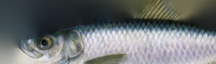

 
# ofxPoissonFill

*Poisson filling shader for OpenFrameworks*


- Uses GLSL shader
- Uses convolution pyramid algorithm
- Fast
- Header-only

## Installation

Drop the folder into `OF_ROOT/addons`. Done!

Or even simpler, copy paste `src/ofxPoissonFill.hpp` directly to your own `src` folder.


## Usage

```cpp
PoissonFill pf;

ofTexture tex; 

// prepare your image here...

// allocate necessary datastructures (once)
pf.init(tex.getWidth(), tex.getHeight());

// process the image
pf.process(tex);

// draw processed image
pf.getTexture().draw(0,0);

```

## Reference

- [Convolution Pyramids, Farbman et al., 2011](https://www.cse.huji.ac.il/labs/cglab/projects/convpyr/data/convpyr-small.pdf)
- [Rendu](https://github.com/kosua20/Rendu)